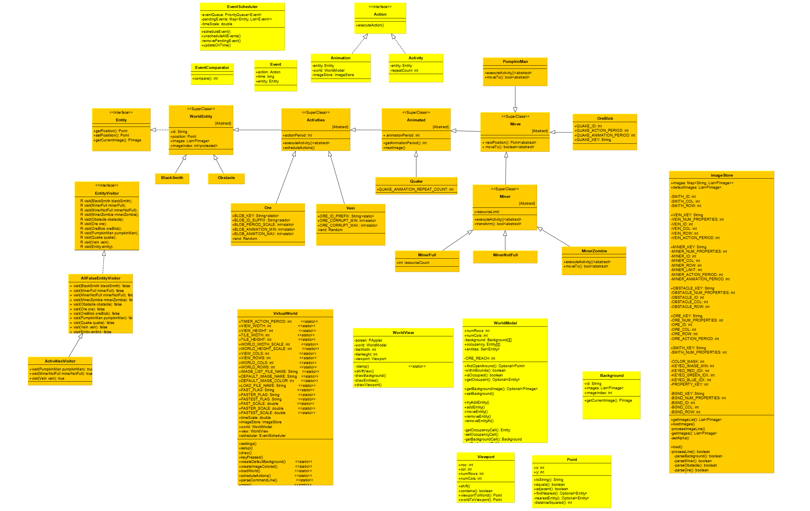

# Java OOP Final Project

* **Programming Language**: Java 8 SDE

* **Development Environment**: IntelliJ IDE 

* **Class**: CPE 203 Introduction to Object-Oriented Programming 

* **Purpose**: Refactoring a large codebase using object oriented programming 

In my Object-Oriented Programming class, we were given a large disorganized code base for a 2D Virtual World inhabited by human characters and creatures. We were tasked with redesigning the code base from a functional programming style to an object-oriented programming style, where each character and object in the world would have its own program file. I created 40 new object classes for the world, making the code bade more organized, legible and adaptable to new code. 

In addition to organizing the code, I added new objects and characters to the world. My virtual world would dynamically create graveyards throughout the world that would spawn zombies from the ground. These zombies would seek human characters and turn them into zombies, while creatures in the environment would either convert these zombies back into humans or destroy them in self-defense.

* My Java code can be viewed in the `/src` directory
* The graph documenting all the objects and their methods are stored in `Methods.graphml` and can be viewed using the **yEd Graph Editor**
* The original code and graph are included in the `/original` directory, to see the source code before refactoring

**Note:** This if for demonstration purposes only. Do not plagiarize this source code.